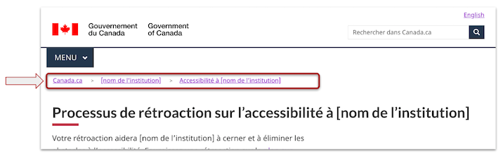
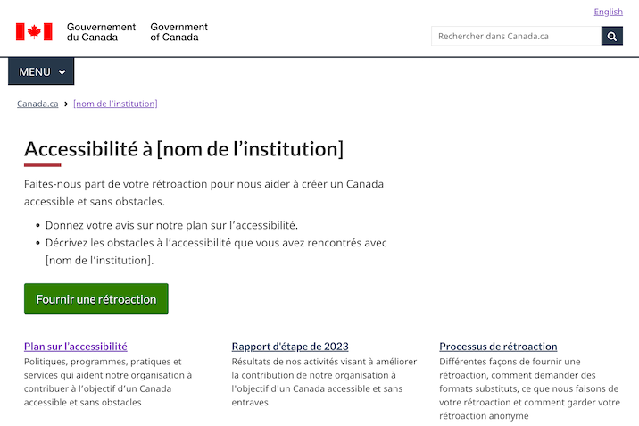
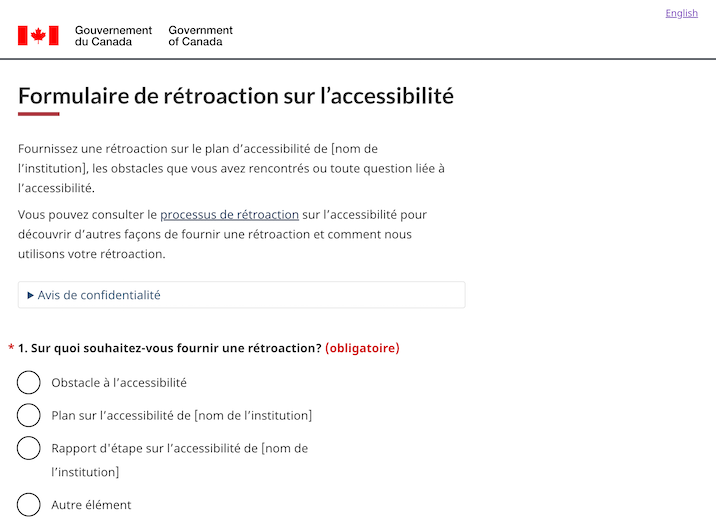
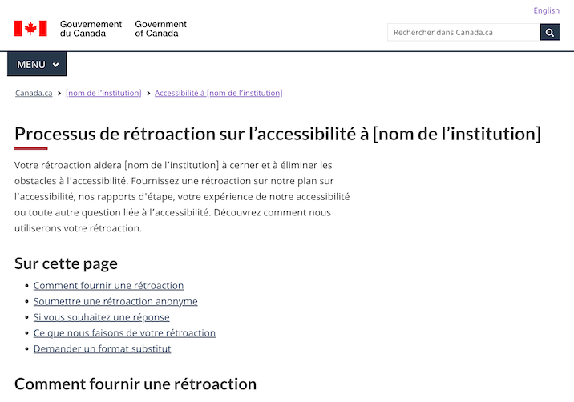

<h1 property="name" id="wb-cont" dir="ltr">DDocumentation pour les modèles de la Loi canadienne sur l'accessibilité: Système de conception de Canada.ca</h1>
<section>
  
Les ministères, organismes et sociétés d'État du gouvernement doivent publier un plan d'accessibilité, un processus de rétroaction et un mécanisme de rétroaction sur leurs sites Web.

  
Ces modèles sont conçus pour aider les ministères à mettre en œuvre ces exigences de manière cohérente.

  
L'approche et les instructions ici ont été présentées en novembre pour assister les gestionnaires de sites Web dans la mise en œuvre de ces changements. 

  <h2>Sur cette page</h2>
  <ul>
    <li><a href="#contexte">Contexte</a></li>
    <li><a href="#approche">Approche recommandée</a></li>
    <li><a href="#prochaine">Prochaines étapes</a></li>
    <li><a href="#annexe">Annexe</a></li>
  </ul>
</section>
<section>
  <h2 id="contexte">Contexte</h2>
  <h3>Trois modèles clés</h3>
  
Trois modèles qui ont une incidence sur les institutions sur Canada.ca&nbsp;:

  <ul>
    <li>Plan sur l’accessibilité de l’institution</li>
    <li>Description du processus de rétroaction sur l’accessibilité de l’institution</li>
    <li>Mécanisme de rétroaction sur l’accessibilité de l’institution</li>
  </ul>
  
Ceux-ci découlent des exigences de la Loi canadienne sur l’accessibilité et de son Règlement d’application.

  <ul>
    <li><a href="https://www.canada.ca/fr/emploi-developpement-social/programmes/directives-reglements-canadien-accessibilite.html">Lignes directrices sur le Règlement canadien sur l'accessibilité</a></li>
  </ul>
  
<strong>Date limite de publication</strong>&nbsp;: 31 décembre 2022

  <h3>Qu'est-ce qu'un plan sur l’accessibilité?</h3>
  
Un document qui décrit le plan d’une institution concernant l’accessibilité de tous ses programmes, produits et services. Offre une vue d’ensemble de l’accessibilité, de ce qui se trouve en ligne à &laquo;&nbsp;la vraie vi&nbsp;&raquo;, à la fois publique et interne.

  
Le plan sur l’accessibilité est le premier livrable d’un cycle de planification et de rapport de trois ans (rapports d’étape annuels à venir).

  <h3>Qu'est-ce qu'une description du processus de rétroaction sur l’accessibilité?</h3>
  
Une description publiée du fonctionnement de votre processus de rétroaction de votre institution. Il doit être publié avec votre plan sur l’accessibilité. 

  <h3>Qu'est-ce qu'un mécanisme de rétroaction sur l’accessibilité?</h3>
  
Un moyen pour les utilisateurs des programmes et services d’un établissement de fournir une rétroaction sur tout aspect de l’accessibilité de ses programmes et services. Le mécanisme de rétroaction doit être toujours disponible, car les processus de rétroaction sont censés être continus.

  
Un formulaire en ligne n’est qu’un aspect du mécanisme de rétroaction, car les personnes doivent pouvoir donner leur avis par divers moyens.

</section>
<section>
  <h2 id="approche">Approche recommandée</h2>
  
Les exemples suivants représentent l’approche recommandée – ce ne sont pas des modèles obligatoires.

  <ul>
    <li>Point de départ – ajustez au besoin pour votre situation particulière.</li>
    <li>Conçu pour la simplicité et axé sur les principales tâches de l’utilisateur, telles que fournir une rétroaction, examiner le plan et comprendre le processus.</li>
    <li>Élaboré avec des éléments de code de la Boîte à outils de l’expérience Web (BOEW) normalisés afin de maximiser la conformité à WCAG.</li>
  </ul>
</section>
<ul class="list-unstyled mrgn-tp-lg">
  <li>
    

      
Structure de l’information

      <h3>Architecture d'information recommandée pour les sites web institutionnels</h3>
      <figure class="gc-complex-img" role="group">
        <figcaption>
          

            
Description détaillée

            
Diagramme de la structure recommandée d'un site web. Première rangée en haut&nbsp;: Page de d'accueil de l'institution (PAI)
              Deuxième rangée&nbsp;: Page d'accessibilité. Troisième rangée en bas, 3 éléments&nbsp;: Plan sur l'accessibilité, mécanisme de rétroaction, description du processus de rétroaction.

          

        </figcaption>
      </figure>
      <h4>Lien vers l’accessibilité à partir de la Page d’accueil de l’institution (PAI)</h4>
      
Le libellé de lien recommandé est &laquo;&nbsp;Accessibilité&nbsp;&raquo;

      <figure class="gc-complex-img" role="group">
        <figcaption>
          

            
Description détaillée

            
Capture d'écran du site Web public d'Agriculture et Agroalimentaire Canada. Sous la rubrique &laquo;&nbsp;À propos d'AAC&nbsp;&raquo;, vous trouverez quatre liens&nbsp;: À propos de notre ministère, Transparence, Accessibilité, Opportunités d'emploi.

          

        </figcaption>
      </figure>
      
 Exemple tiré de la <a href="https://agriculture.canada.ca/fr">page d’accueil institutionnelle d’Agriculture et Agroalimentaire Canada (AAC)</a>

      <h3>Fil d’Ariane pour les produits d’accessibilité</h3>
      <figure class="gc-complex-img" role="group">
        <figcaption>
          

            
Description détaillée

            
Capture d'écran du site web du gouvernement du Canada. Les fils d'Ariane sont&nbsp;: Canada.ca, Nom de l'institution, Accessibilité à &laquo;&nbsp;Nom de l'institution&nbsp;&raquo;.

          

        </figcaption>
      </figure>
      <h4>Facteurs de conception</h4>
      
Bien que le BTN recommande de créer un nœud d’accessibilité dans l’AI de votre institution, il peut également être judicieux de créer des liens croisés à partir d’autres endroits sur vos sites, tels que :

      <ul>
        <li>Lien vers le plan sur l’accessibilité à partir d’une section &laquo;&nbsp;Rapports et plans&nbsp;&raquo;.</li>
        <li>Lien vers le formulaire de rétroaction sur l’accessibilité à partir de vos pages &laquo;&nbsp;Contactez-nous&nbsp;&raquo;».</li>
      </ul>
    

  </li>
  <li>
    

      
Page d’accessibilité de l’institution

      <h3>Modèle recommandé</h3>
      <figure class="gc-complex-img" role="group">
        <figcaption>
          

            
Description détaillée

            
Capture d'écran du site Web du gouvernement du Canada intitulé &laquo;&nbsp;Accessibilité à nom de l'institution&nbsp;&raquo;. Il y a un bouton vert intitulé &laquo;&nbsp;Fournir une rétroaction&nbsp;&raquo;, puis deux liens&nbsp;: Plan sur l'accessibilité et Processus de rétroaction.

          

        </figcaption>
      </figure>
      
 <a href="accessibilite.html">Exemples - Page d’accessibilité de l’institution</a>

      <h3>Facteurs de conception</h3>
      <ul>
        <li>La tâche principale sera probablement de fournir une rétroaction, donc la page utilise le bouton Super-tâche.</li>
        <li>Il est possible de mettre en place d’autres pages d’accueil au besoin.</li>
        <li>D’autres modèles peuvent également être utilisés sur cette page (p. ex., la bande la plus demandée, les fonctionnalités contextuelles).</li>
        <li>La conception évoluera probablement à mesure que les exigences futures seront mises en ligne, p. ex., déclarations d’accessibilité requises en vertu de la <a href="https://a11y.canada.ca/fr/standards/">norme d’accessibilité des TIC proposée</a>.</li>
      </ul>
    

  </li>
  <li>
    

      
Plan sur l’accessibilité

      <h3>Modèle recommandé</h3>
      <figure class="gc-complex-img" role="group">
        <figcaption>
          

            
Description détaillée

            
Capture d'écran du site Web du gouvernement du Canada intitulée &laquo;&nbsp;Plan sur l'accessibilité de l'institution&nbsp;&raquo; avec un lien vers un modèle de plan d'accessibilité. Sous ce lien se trouve un lien intitulé &laquo;&nbsp;Liste des plans d'accessibilité élaborés par d'autres institutions&nbsp;&raquo;.

          

        </figcaption>
      </figure>
      
 <a href="plan.html">Exemples - Plans sur l'accessibilité</a>

      <h3>Facteurs de conception</h3>
      
Assurez-vous que le plan répond aux exigences décrites dans 
        <a href="https://www.canada.ca/fr/emploi-developpement-social/programmes/directives-reglements-canadien-accessibilite/plans-accessibilite.html">Directives associées aux plans sur l’accessibilité</a>&nbsp;:

      <ul>
        <li>Ces directives comprennent un modèle de contenu pour le plan lui-même.</li>
      </ul>
      
Les gens sont encouragés à fournir une rétroaction au sujet des plans sur l’accessibilité – assurez-vous qu’il y a un lien vers le processus de rétroaction et/ou le formulaire de rétroaction à partir du plan lui-même.

      
Pour faciliter la recherche, le SCT crée un index central des plans sur l’accessibilité sur le <a href="https://ouvert.canada.ca/fr">site du gouvernement ouvert</a>&nbsp;:

      <ul>
        <li>Inclure un lien de votre plan vers l’index central.</li>
        <li>Soumettre un dossier des métadonnées pour votre plan.</li>
        <li>Voir l’annexe pour les instructions.</li>
      </ul>
      
Selon les <a href="https://www.tbs-sct.canada.ca/pol/doc-fra.aspx?id=27167">Procédures sur l’édition</a>, les plans sur l’accessibilité sont estimés comme des publications :

      <ul>
        <li>Demander un ISSN et soumettre une copie à publications.gc.ca</li>
        <li>Voir l’annexe pour les instructions.</li>
      </ul>
      
Les institutions doivent aviser le commissaire à l’accessibilité de la Commission canadienne des droits de la personne dans les 48 heures suivant la publication de leurs plans sur l’accessibilité&nbsp;:

      <ul>
        <li>Envoyez un courriel à <a href="mailto:Info.Com@chrc-ccdp.gc.ca">Info.Com@chrc-ccdp.gc.ca</a> ou utilisez le service &laquo;&nbsp;<a href="https://www.accessibilitychrc.ca/fr/aviser-le-commissaire-laccessibilite">Mon portail sur l’accessibilité</a>&nbsp;&raquo; de la CCDP.</li>
        <li>Inclure un lien ou une URL pour le plan dans le courriel que vous envoyez.</li>
      </ul>
    

  </li>
  <li>
    

      
Formulaire de rétroaction sur l’accessibilité

      <h3>Modèle recommandé – formulaire de rétroaction</h3>
      <figure class="gc-complex-img" role="group">
        <figcaption>
          

            
Description détaillée

            
Capture d'écran du site Web du gouvernement du Canada intitulé &laquo;&nbsp;Formulaire de rétroaction sur l'accessibilité&nbsp;&raquo;. Exemple de question avec des boutons radio.

          

        </figcaption>
      </figure>
      
 <a href="formulaire-retroaction.html">Exemples - Formulaire de rétroaction sur l'accessibilité</a>

      <h4>Modèle recommandé – Page d’accusé de réception</h4>
      <figure class="gc-complex-img" role="group">
        <figcaption>
          

            
Description détaillée

            
Capture d'écran du site Web du gouvernement du Canada intitulée &laquo;&nbsp;Votre rétroaction a été soumise&nbsp;&raquo;. Nous vous remercions pour votre rétroaction.

          

        </figcaption>
      </figure>
      
 <a href="retroaction-soumission.html">Exemples - Page d'accusé de réception</a>

      <h3>Facteurs de conception</h3>
      
Vous devrez rattacher le formulaire de rétroaction à quelque chose – un courriel générique, un système de billetterie, etc. (n’oubliez pas de conserver les rétroactions reçues pendant sept ans!).

      <ul>
        <li>Utilisateurs d’Adobe Experience Manager (AEM) – <a href="http://requestform.portal.gc.ca/billets.html">envoyez un billet à l’éditeur principal</a> pour tirer parti de la solution &laquo;&nbsp;archiver et oublier&nbsp;&raquo; pour rattacher les formulaires à une adresse de courriel.</li>
      </ul>
      
Les personnes soumettant une rétroaction ont la possibilité de demander une réponse – la conception du formulaire comprend des informations sur les délais d’exécution dans le cadre de ce scénario.

      
Le formulaire a été conçu pour minimiser la collecte de renseignements d’identification personnelle (RIP)&nbsp;:

      <ul>
        <li>Lorsque l’utilisateur demande spécifiquement une réponse, il ne demande qu’une adresse courriel.</li>
        <li>Comprend des instructions pour que les utilisateurs n’indiquent pas des renseignements personnels dans la zone de commentaires.</li>
      </ul>
      
Lors de la création de votre propre mise en œuvre, consultez le coordonnateur de l’AIPRP de votre organisation.

    

  </li>
  <li>
    

      
Description du processus de rétroaction sur l’accessibilité

      <h3>Modèle recommandé</h3>
      <figure class="gc-complex-img" role="group">
        <figcaption>
          

            
Description détaillée

            
Capture d'écran du site Web du gouvernement du Canada intitulé &laquo;&nbsp;Processus de rétroaction sur l'accessibilité à nom de l'institution&nbsp;&raquo;. De nombreux liens sur la façon de fournir de la rétroaction.

          

        </figcaption>
      </figure>
      
 <a href="processus-retroaction.html">Exemples - Description du processus de rétroaction sur l'accessibilité</a>

      <h4>Facteurs de conception</h4>
      
Conçu pour se concentrer sur les besoins prioritaires des utilisateurs, plutôt que de fournir une description exhaustive des procédures de l’arrière-guichet.

      
Assurez-vous que le processus sous-jacent répond aux exigences décrites dans la <a href="https://www.canada.ca/fr/emploi-developpement-social/programmes/directives-reglements-canadien-accessibilite/processus-retroaction/introduction.html">Description du processus de rétroaction</a>.

      <ul>
        <li>Les personnes doivent être en mesure de fournir une rétroaction par divers moyens, y compris le courrier électronique, le téléphone, le courrier postal.</li>
        <li>La rétroaction doit être analysée et faire l’objet de rapports à l’avenir.</li>
      </ul>
      
Comme pour les plans sur l’accessibilité, les institutions doivent aviser le commissaire à l’accessibilité de la Commission canadienne des droits de la personne dans les 48 heures suivant la publication de leur description de processus.

      <ul>
        <li>Envoyez un courriel à <a href="mailto:Info.Com@chrc-ccdp.gc.ca">Info.Com@chrc-ccdp.gc.ca</a> ou utilisez le service &laquo;&nbsp;<a href="https://www.accessibilitychrc.ca/fr/aviser-le-commissaire-laccessibilite">Mon portail sur l’accessibilité</a>&nbsp;&raquo; de la CCDP.</li>
        <li>Inclure un lien ou une URL pour la description du processus dans le courriel que vous envoyez.</li>
      </ul>
    

  </li>
</ul>
<section>
  <h2 id="prochaine">Prochaines étapes – Perfectionnement des exemples</h2>
  
Ces exemples sont une première étape&nbsp;:

  <ul>
    <li>Assurer le suivi et effectuer des itérations, sur la base de données probantes.</li>
    <li>Au fur et à mesure de la mise en œuvre par les ministères et agences, fournir des commentaires et une rétroaction à <a href="mailto:dto.btn@tbs-sct.gc.ca">dto.btn@tbs-sct.gc.ca</a></li>
    <li>Ils s’intégreront à la bibliothèque de modèles et de configurations sur <a href="https://www.canada.ca/fr/gouvernement/a-propos/systeme-conception/bibliotheque-modeles.html">conception.canada.ca</a></li>
  </ul>
</section>
<section>
<h2 id="annexe">Annexe – Plans sur l’accessibilité</h2>
<h3>Procédures de publication en vertu de la Politique sur les communications et l’image de marque</h3>

Étant donné que les plans sur l’accessibilité des institutions sont estimés comme des publications officielles du gouvernement du Canada, une version PDF du plan sur l’accessibilité doit être incluse dans le <a href="https://publications.gc.ca/site/fra/accueil.html">catalogue</a>.

Suivez ces étapes :

<ol>
  <li>Obtenir un ISSN auprès de Bibliothèque et Archives Canada&nbsp;: 
    <a href="https://publications.gc.ca/site/fra/services/faireDemandeISBN.html">Numéro international normalisé des publications en série (ISSN)</a></li>
  <li>Obtenir un numéro de catalogue du GC auprès de SPAC&nbsp;: 
    <a href="https://publications.gc.ca/site/fra/services/faireDemandeISBN.html">Numéros de catalogue – Publications du gouvernement du Canada</a></li>
  <li>Mettez les deux numéros dans vos plans sur l’accessibilité, conformément aux directives de SPAC sur les pages sur le droit d’auteur&nbsp;: 
    <a href="https://publications.gc.ca/site/fra/services/formePageDroitAuteur.html">Mise en forme de la page sur le droit d’auteur</a></li>
  <li>Soumettre à SPAC pour affichage sur publications.gc.ca par courriel : 
    <a href="mailto:publications.acquisitions@pwgsc.gc.ca">publications.acquisitions@pwgsc.gc.ca</a></li>
</ol>

<strong>Conseil</strong>&nbsp;: étant donné le thème du plan sur l’accessibilité, préparez un <a href="https://helpx.adobe.com/ca_fr/acrobat/using/creating-accessible-pdfs.html">PDF accessible</a>.

<h3>Créez un dossier de métadonnées sur open.canada.ca</h3>

Pour vous assurer que votre plan sur l’accessibilité de l’institution est inclus dans l’index central sur ouvert.canada.ca, vous devez soumettre un dossier des métadonnées&nbsp;:

<ol>
  <li>Créez un <a href="http://registry.open.canada.ca/fr/">compte du Registre</a>&nbsp;: sélectionnez <strong>Demander un compte</strong>.  L’activation du compte peut prendre jusqu’à 24 heures.</li>
  <li>Une fois votre compte créé, vous pourrez créer votre fiche en renseignant les métadonnées requises. 
    <strong>Veuillez noter</strong>&nbsp;: vous aurez besoin de l’approbation des CSGI de votre institution pour publier un document.  Une fois l’approbation donnée, vous n’aurez pas besoin d’une approbation supplémentaire pour les futures mises à jour.  Nous ne vous demandons pas de nous fournir l’approbation.</li>
  <li>Sélectionnez l’actif <strong>Créer un plan sur l’accessibilité de l’institution</strong> sur la page d’accueil du Registre.</li>
  <li>Sélectionnez <strong>Plans sur l’accessibilité institutionnels</strong> dans la liste déroulante et remplissez les champs de métadonnées. 
    Ce formulaire vous permet de décrire chaque ressource affectée à un ensemble de données ou à une ressource.</li>
</ol>

Une fois terminé, votre dossier sera placé dans la file d’attente de l’équipe du Registre du gouvernement ouvert pour examen et publication dans les 24 heures.

Veuillez communiquer avec le représentant du gouvernement ouvert de votre institution si vous avez des questions supplémentaires.

</section>
