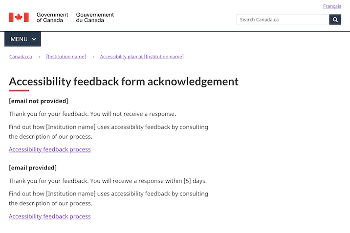
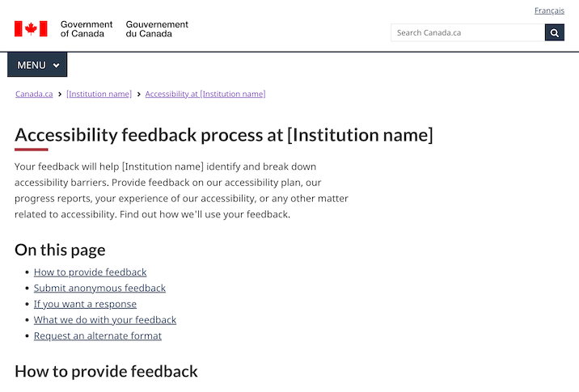

<h1 property="name" id="wb-cont" dir="ltr">Documentation for accessibility templates: Canada.ca design system</h1>
<section class="container">
  

    
Government departments, agencies and Crown corporations are required to publish an accessibility plan, a feedback process and a feedback mechanism on their websites.

    
These templates are designed to help departments implement these requirements in a consistent way.

    
The approach and instructions here were presented in November to support web managers implementing these changes.

    <h2>On this page</h2>
    <ul>
      <li><a href="#context">Context</a></li>
      <li><a href="#approach">Recommended approach</a></li>
      <li><a href="#next">Next steps</a></li>
      <li><a href="#annex">Annex</a></li>
    </ul>
  

</section>
<section class="container">
  

    <h2 id="context">Context</h2>
    <h3>3 key design patterns</h3>
    
3 patterns that impact institutions on Canada.ca:

    <ul>
      <li>Institutional accessibility plan</li>
      <li>Institutional accessibility feedback process description</li>
      <li>Institutional accessibility feedback mechanism</li>
    </ul>
    
These are derived from the requirements under the Accessible Canada Act and Regulations.

    <ul>
      <li><a href="https://www.canada.ca/en/employment-social-development/programs/accessible-canada-regulations-guidance.html">Guidance on the Accessible Canada Regulations</a></li>
    </ul>
    
<b>Publishing deadline</b>: December 31, 2022

    <h3>What are accessibility plans?</h3>
    
A document that outlines an institution's plan regarding the accessibility of all its programs, products, and services. Takes a total view of accessibility, from online to in real life (IRL), both public-facing and internal.

    
The accessibility plan is the first deliverable in a 3-year planning and reporting cycle (annual progress reports to come).

    <h3>What is the accessibility feedback process description?</h3>
    
A published description of how your institutional feedback process works. It must be published alongside your accessibility plan.

    <h3>What is the accessibility feedback mechanism?</h3>
    
A means for the users of an institution's programs and services to provide feedback about any aspect of the accessibility of its programs and services.

    
The feedback mechanism must be always available, as feedback processes are meant to be ongoing.

    
An online form is only one aspect of the feedback mechanism, as people must be able to give feedback by a variety of means.

  

</section>
<section class="container">
  

    <h2 id="approach">Recommended approach</h2>
    
The following working examples represent the recommended approach - not mandatory templates.

    <ul>
      <li>Starting point - adjust as needed for your situation</li>
      <li>Designed for simplicity and with a focus on top user tasks like providing feedback, reviewing the plan, and understanding the process</li>
      <li>Built with standard WET code elements to maximize WCAG conformance</li>
    </ul>
  

</section>

  

    

      
Information structure and navigation

      <h3>Recommended information architecture for institutional websites</h3>
      <figure class="gc-complex-img" role="group"> 
        <figcaption>
          

            
Detailed description

            
Diagram of recommended website structure. First row on top: Institutional landing page (ILP). Second row: Accessibility page. Third row at the bottom, 3 elements: Accessibility plan, Feedback mechanism, Description of feedback process

          

        </figcaption>
      </figure>
      <h4>Accessibility link from Institutional landing page (ILP)</h4>
      
Recommended link label is "Accessibility"

      <figure class="gc-complex-img" role="group"> 
        <figcaption>
          

            
Detailed description

            
Screenshot of Agriculture and Agri-Food Canada's public facing website. Under 'About AAFC', you can find 4 links: About our department, Transparency, Accessibility, Job opportunities.

          

        </figcaption>
      </figure>
      
Example drawn from <a href="https://agriculture.canada.ca/en">AAFC’s institutional landing page</a>

      <h3>Breadcrumb for accessibility products</h3>
      <figure class="gc-complex-img" role="group"> 
        <figcaption>
          

            
Detailed description

            
Screenshot of the Government of Canada's website. The breadcrumbs are: Canada.ca, Institution name, Accessibility at 'Institution name'

          

        </figcaption>
      </figure>
      <h4>Design considerations</h4>
      
While DTO recommends creating an accessibility node in your institution’s information architecture, it may also make sense to cross-link from elsewhere on your sites, such as:

      <ul>
        <li>Linking to the accessibility plan from a “Reports and plans” section</li>
        <li>Linking to the accessibility feedback form from your “Contact us” pages</li>
      </ul>
    

    

      
Institutional accessibility page

      <h3>Recommended template</h3>
      <figure class="gc-complex-img" role="group"> 
        <figcaption>
          

            
Detailed description

            
Screenshot of the Government of Canada's website titled 'Accessibility at Institution name'. There is a green button named 'Provide feedback', then 2 links: Accessibility Plan and Feedback process.

          

        </figcaption>
      </figure>
      
<a href="accessibility.html">Working examples - Institutional accessibility page</a>

      <h3>Design considerations</h3>
      <ul>
        <li>Likely top task will be giving feedback, so the page uses the Super-task button</li>
        <li>Additional doormats can be added as needed</li>
        <li>Other patterns can be used as well on this page (e.g. Most requested band, contextual features)</li>
        <li>Design will likely evolve as future requirements come online, e.g. accessibility statements required under the <a href="https://a11y.canada.ca/en/standards/">proposed ICT accessibility standard</a></li>
      </ul>
    

    

      
Accessibility plan

      <h3>Recommended template</h3>
      <figure class="gc-complex-img" role="group"> 
        <figcaption>
          

            
Detailed description

            
Screenshot of the Government of Canada's website titled 'Accessibility plan at Institution name' with a link to a Sample Accessibility Plan Template. Under it there is a link titled 'List of accessibility plans from other institutions'.

          

        </figcaption>
      </figure>
      
<a href="plan.html">Working examples - Accessibility plan</a>

      <h3>Design considerations</h3>
      
Ensure the plan meets the requirements outlined in <a href="https://www.canada.ca/en/employment-social-development/programs/accessible-canada-regulations-guidance/accessibility-plans.html">Guidance on accessibility plans</a>:

      <ul>
        <li>This guidance includes a content template for the plan itself</li>
      </ul>
      
People are encouraged to provide feedback on accessibility plans - ensure there is a link to the feedback process and/or feedback form from within the plan itself.

      
To assist with findability, TBS is creating a central index for accessibility plans on the <a href="https://open.canada.ca/">Open government site</a>:

      <ul>
        <li>Include a link from your plan to the central index</li>
        <li>Submit a metadata record for your plan</li>
        <li>See annex for instructions</li>
      </ul>
      
According to the <a href="https://www.tbs-sct.canada.ca/pol/doc-eng.aspx?id=27167">Procedures for publishing</a>, institutional accessibility plans are considered publications:

      <ul>
        <li>Request an ISSN and submit a copy to publications.gc.ca</li>
        <li>See annex for instructions</li>
      </ul>
      
Institutions must notify the Accessibility Commissioner at the Canadian Human Rights Commission within 48 hours of publishing their accessibility plans:

      <ul>
        <li>Send an email to Info.Com@chrc-ccdp.gc.ca or use the CHRC’s <a href="https://www.accessibilitychrc.ca/en/notifying-accessibility-commissioner">My Accessibility Portal</a> service</li>
        <li>Include a link or URL for the plan in the email you send</li>
      </ul>
    

    

      
Accessibility feedback form

      <h3>Recommended template – feedback form</h3>
      <figure class="gc-complex-img" role="group"> 
        <figcaption>
          

            
Detailed description

            
Screenshot of the Government of Canada's website titled 'Accessibility feedback form'. Example of question with radio buttons.

          

        </figcaption>
      </figure>
      
<a href="feedback-form.html">Working examples - Accessibility feedback form</a>

      <h4>Recommended template - acknowledgement page</h4>
      <figure class="gc-complex-img" role="group"> 
        <figcaption>
          

            
Detailed description

            
Screenshot of the Government of Canada's website titled 'Accessibility feedback form acknowledgement'. Thank you for your feedback.

          

        </figcaption>
      </figure>
      
<a href="feedback-acknowledgement.html">Working examples - Acknowledgement page</a>

      <h3>Design considerations</h3>
      
You will need to hook the intake form up to something - a generic email, a ticketing system, etc. (remember to keep incoming feedback for 7 years!)

      <ul>
        <li>AEM users - send a ticket to Principal Publisher to leverage the “file and forget” solution for hooking forms up to an email address</li>
      </ul>
      
People submitting feedback have the option to request a response - form design includes information on turnaround times in this scenario.

      
Form has been designed to minimize the collection of personally identifiable information (PII):

      <ul>
        <li>When the user specifically requests a response, it only asks for an email address</li>
        <li>Includes instructions for users to not include PII in the comment box</li>
      </ul>
      
When creating your own implementation, consult with your organization’s ATIP coordinator. 

    

    

      
Accessibility feedback process description

      <h3>Recommended template</h3>
      <figure class="gc-complex-img" role="group"> 
        <figcaption>
          

            
Detailed description

            
Screenshot of the Government of Canada's website titled 'Accessibility feedback process at institution name'. Many links how to provide feedback.

          

        </figcaption>
      </figure>
      
<a href="feedback-process.html">Working examples - Accessibility feedback process description</a>

      <h4>Design considerations</h4>
      
Designed to focus on top-of-mind user needs, rather than providing an exhaustive description of back-office procedures.

      
Ensure the underlying process meets the requirements outlined in Guidance on feedback processes:

      <ul>
        <li>People must be able to provide feedback by a variety of means, including email, telephone, snail mail</li>
        <li>Feedback must be analyzed and reported on in future</li>
      </ul>
      
As with accessibility plans, institutions must notify the Accessibility Commissioner at the Canadian Human Rights Commission within 48 hours of publishing their process description.

      <ul>
        <li>Send an email to Info.Com@chrc-ccdp.gc.ca or use the CHRC’s <a href="https://www.accessibilitychrc.ca/en/notifying-accessibility-commissioner">My Accessibility Portal</a> service</li>
        <li>Include a link or URL for the process description in the email you send</li>
      </ul>
    

  

<section class="container">
  

    <h2 id="next">Next steps - Maturing the working examples</h2>
    
These working examples are a first step:

    <ul>
      <li>Will monitor and iterate, based on data and evidence</li>
      <li>As departments and agencies implement, provide comments and feedback to dto.btn@tbs-sct.gc.ca</li>
      <li>Will integrate to the pattern and template library</li>
    </ul>
  

</section>
<section class="container">
  

    <h2 id="annex">Annex - Publishing plans</h2>
    <h3>Procedures for publishing under the Policy on Communications and Federal Identity</h3>
    
Since institutional accessibility plans are considered official publications of the Government of Canada, a PDF version of the accessibility plan needs to be included in the <a href="https://publications.gc.ca">catalogue at publications.gc.ca</a>.

    
Follow these steps:

    <ol>
      <li>Obtain an ISSN from Library and Archives Canada: 
        <a href="https://library-archives.canada.ca/eng/services/publishers/issn/Pages/issn.aspx">International Standard Serial Numbers (ISSN)</a></li>
      <li>Obtain a GC catalogue number from PSPC: 
        <a href="https://publications.gc.ca/site/eng/services/applyForISBN.html">Catalogue numbers - Government of Canada Publications</a></li>
      <li>Put both numbers in your Accessibility plans, as per PSPC guidance on copyright pages: 
        <a href="https://publications.gc.ca/site/eng/services/formatCopyPage.html">Formatting the copyright page</a></li>
      <li>Submit to PSPC for posting on publications.gc.ca via email: 
        publications.acquisitions@pwgsc.gc.ca</li>
    </ol>
    
<b>Tip</b>: given the subject matter of the accessibility plan, prepare an accessible PDF.

    <h3>Create a metadata record on open.canada.ca</h3>
    
To ensure your institutional accessibility plan is included in the central index on open.canada.ca, you need to submit a metadata record:

    <ol>
      <li>Create a <a href="http://registry.open.canada.ca/">registry account</a>: select <b>Request an Account</b>.  It can take up to 24 hours for the account to be activated.</li>
      <li>Once your account has been created, you will be able to create your record by populating the required metadata. 
        <b>Note</b>: you will require your institution’s IMSO approval for releasing a record.  Once approval is given, you will not require an additional approval for future updates.  We do not require you to provide the approval to us.</li>
      <li>Select <b>Create Open Information Asset</b> on the registry landing page.</li>
      <li>Select <b>Institutional Accessibility Plans</b> from the dropdown and complete the metadata fields. 
        This form allows you to describe each resource assigned to a dataset or asset.</li>
    </ol>
    
Once completed, your record will be placed in the Open Government Registry publishing queue for review and publication within 24 hours.

    
Please contact your institution’s open government representative should you have additional questions about how to publish records to the registry.

  

</section>
